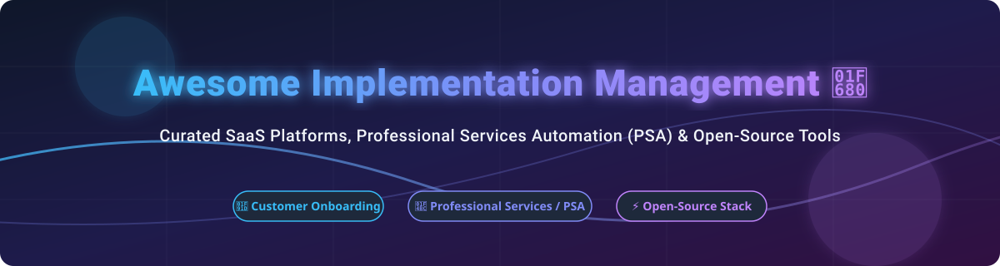

# Awesome Implementation Management 🚀

  
  
  
  

## 📌 Executive Summary & Market Ecosystem

> **Market Insights:** The global **Implementation Management & Professional Services Automation (PSA)** market is estimated at **$12.5 Billion+ (2026)** and is **moderately fragmented**. While legacy PSA platforms serve enterprise IT consultancy, specialized customer onboarding and mutual-action-plan SaaS tools (like Rocketlane and GuideCX) operate alongside modular open-source ERP/PSA suites (like Odoo and ERPNext).

This repository maintains a curated ecosystem list of **SaaS platforms** and **open-source projects** for **Customer Implementation Management**, **Client Onboarding**, and **Professional Services Automation (PSA)**.

---

## 📑 Table of Contents
- [☁️ SaaS / Hosted Platforms](#-saas--hosted-platforms)
- [🔓 Open-Source GitHub Projects](#-open-source-github-projects)
- [🛠️ How to Contribute](#️-how-to-contribute)
- [💖 Support & Sponsorship](#-support--sponsorship)
- [📈 Star History](#-star-history)
- [⚠️ Disclaimer](#️-disclaimer)

---

## ☁️ SaaS / Hosted Platforms

The table below ranks commercial implementation management and client onboarding platforms sorted by estimated company scale (annual revenue/funding valuation):

| Platform | Description | Est. Company Scale (Rev / Val) 📊 | Starting Paid Tier 💳 | Free Tier / Trial Limit ⏳ |
| :--- | :--- | :--- | :--- | :--- |
| **[Monday.com (Work OS)](https://monday.com/)** | Flexible work OS widely adapted for client implementation tracking and cross-team workflows. | **~$900M+ ARR** ($12B+ Cap) | $9/user/month (Basic, min 3 seats) | Free Forever plan (Up to 2 seats, 3 boards) |
| **[Wrike](https://www.wrike.com/)** | Enterprise work management for complex multi-stream customer implementation programs. | **~$190M ARR** (Acquired $2.25B) | $9.80/user/month (Team tier) | 14-day free trial (Up to 25 users) |
| **[Asana](https://asana.com/)** | Work management platform for customer implementation plans and milestone tracking. | **~$650M+ ARR** ($3B+ Cap) | $10.99/user/month (Starter plan) | Free Personal plan (Up to 10 teammates) |
| **[Scoro](https://www.scoro.com/)** | End-to-end PSA platform covering implementation projects, retainers, and profitability. | **~$35M ARR** ($100M+ Val) | $26/user/month (Essential, min 5 seats) | 14-day full featured free trial |
| **[Rocketlane](https://www.rocketlane.com/)** | Purpose-built customer onboarding and PSA platform with client portals and AI workflows. | **~$240M Valuation** ($105M Raised) | $19/user/month (Essential tier) | 14-day free trial (Full portal access) |
| **[GuideCX](https://www.guidecx.com/)** | Onboarding management platform with transparent customer task accountability. | **~$15M ARR** ($40M Raised) | $29/seat/month (Starter package) | 14-day free trial (Unlimited customer guests) |
| **[Accelo](https://www.accelo.com/)** | Client work management system combining implementation projects, retainers, and billing. | **~$12M ARR** | $50/user/month (Professional tier) | 14-day free trial |
| **[Projector PSA](https://www.projectorpsa.com/)** | Professional services automation platform for resource planning and delivery financials. | **~$10M ARR** | $30/user/month (Delivery tier) | 30-day free trial |
| **[TaskRay](https://www.taskray.com/)** | Salesforce-native customer onboarding & implementation project management solution. | **~$6.8M ARR** (Seed stage) | $25/user/month (Standard plan) | 14-day free trial on Salesforce AppExchange |
| **[Dock](https://www.dock.us/)** | Client portal & mutual action plan workspace for shared implementation coordination. | **~$3.2M ARR** ($6.5M Raised) | $350/month (Standard team tier) | Free Forever plan (Up to 5 active client workspaces) |

---

## 🔓 Open-Source GitHub Projects

Below are open-source project management systems, open PSA platforms, and self-hostable suites suitable for customer implementations, sorted by GitHub star count (descending):

| Repository 📦 | GitHub Stars ⭐ | Description 📝 | License 📜 |
| :--- | :--- | :--- | :--- |
| **[Plane](https://github.com/makeplane/plane)** |  | Modern open-source issue tracking & delivery platform for complex onboarding workflows. | AGPL-3.0 |
| **[Odoo Community](https://github.com/odoo/odoo)** |  | Comprehensive modular ERP containing Project, Timesheet, and Customer Portal apps. | LGPL-3.0 |
| **[ERPNext](https://github.com/frappe/erpnext)** |  | Full open-source ERP suite with deep project management, timesheets, and billing modules. | GPL-3.0 |
| **[Focalboard](https://github.com/mattermost/focalboard)** |  | Open-source Trello/Asana alternative for lightweight customer milestone boards. | AGPL-3.0 |
| **[OpenProject](https://github.com/opf/openproject)** |  | Full-featured classic project management tool with Gantt charts and client delivery roadmaps. | GPL-3.0 |
| **[Leantime](https://github.com/leantime/leantime)** |  | Open-source strategic work management system built for non-project managers and implementation leads. | GPL-2.0 |
| **[Taiga](https://github.com/taigaio/taiga-back)** |  | Agile project management platform with customizable Kanban boards for client onboarding. | MPL-2.0 |
| **[Vikunja](https://github.com/go-vikunja/vikunja)** |  | Self-hostable task tracking application with task relations, Gantt charts, and client sharing. | AGPL-3.0 |
| **[Worklenz](https://github.com/Worklenz/worklenz)** |  | Purpose-built open-source PSA platform for services teams with budgets and timesheets. | AGPL-3.0 |
| **[ITFlow](https://github.com/itflow-org/itflow)** |  | Open-source MSP & PSA solution featuring ticketing, client portals, and project billing. | GPL-3.0 |
| **[Alga PSA](https://github.com/Nine-Minds/alga-psa)** |  | Open-source professional services automation community edition for IT service providers. | AGPL-3.0 |

---

## 🛠️ How to Contribute

1. Fork this repository 🍴
2. Add or update entries in `README.md` following our standard tabular format 📝
3. Submit a Pull Request with factual documentation links 🚀

---

## 💖 Support & Sponsorship

If you find this curated ecosystem list helpful for evaluating your organization's implementation stack, please consider supporting the project!

- **⭐ Star this repository** to help others discover it.
- **🔄 Share it** with your customer success, onboarding, and professional services peers.
- **☕ Sponsor the maintainer**: Buy me a coffee via [GitHub Sponsors](https://github.com/sponsors/ishandutta2007)!

---

## 📈 Star History

---

## ⚠️ Disclaimer

- This is a community-curated list and does not constitute formal commercial advice or endorsement.
- All product names, logos, and trademarks belong to their respective owners.
